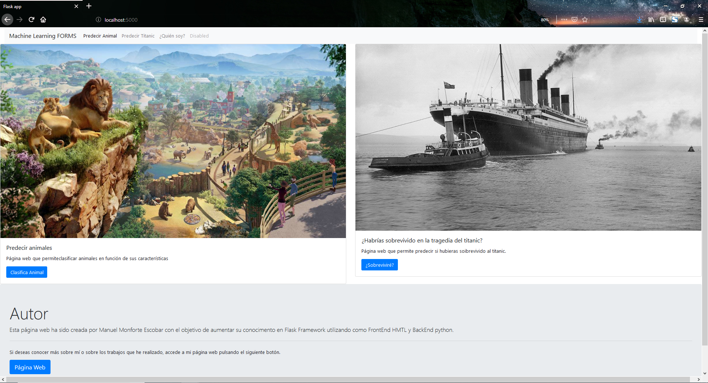
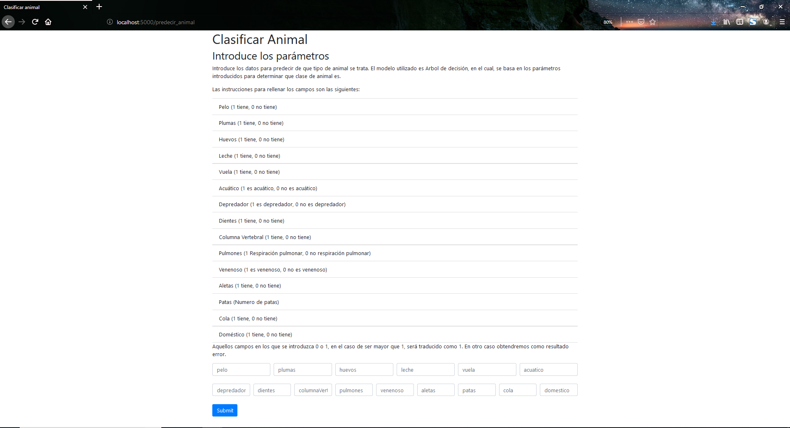
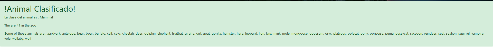

# webApp

Repository used in order to learn Flask Framework for creating web apps.

## Prerequisites

You need to download Flask and install python:

[Python 3.7](https://www.python.org/downloads/)

[Flask Framework](http://flask.pocoo.org/docs/1.0/installation/)

I recommend this IDE for pyhton called:

[Spyder](https://www.spyder-ide.org/)

## Language

    Python 3.6 Version
   

## How to use it

In the command Prompt you must be in the root path of the app and enter :

`python main.py`

The app will be deploy in the port 5000. Insert in your browser this URL http://localhost:5000/ and the you can use app.

## Images from the Web Application

## Contributing

When contributing to this repository, please first discuss the change you wish to make via issue, email, or any other method with the owners of this repository before making a change.

## Versioning

We use GitHub

## Authors

[Manuel Monforte](https://github.com/manumonforte)

## License

This project is licensed under the GPL License - see the LICENSE.md file for details
